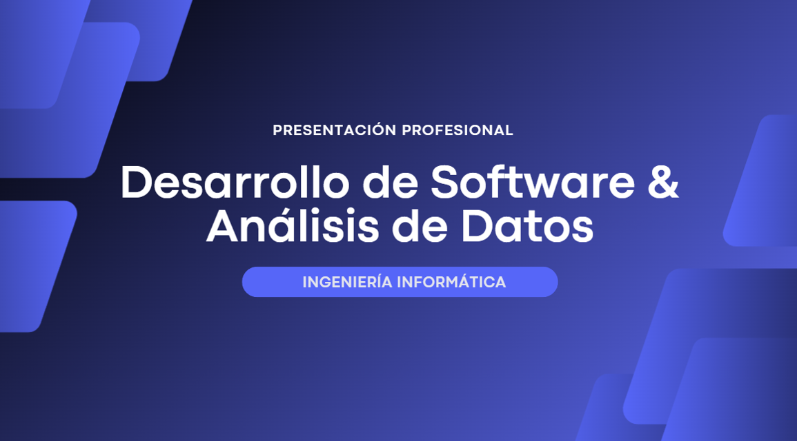

# 👋 Hola, soy Felipe Rojas

  

## 💻 Desarrollador & Analista de Datos  
🎓 Ingeniero Informático

Perfil técnico–analítico con experiencia en desarrollo de aplicaciones web, bases de datos y análisis de información para la toma de decisiones.

---

## 🧠 Áreas de especialización
- Desarrollo de software (Backend / Full Stack)
- Análisis y visualización de datos
- Modelado y gestión de bases de datos
- Automatización de reportes
- Soluciones tecnológicas orientadas al negocio

---

## 🛠️ Tecnologías
- **Lenguajes:** Python, SQL, JavaScript  
- **Frameworks:** Flask  
- **Datos:** Power BI, Excel Avanzado  
- **Bases de datos:** PostgreSQL, SQLite  
- **Herramientas:** Git, GitHub

---

## 📌 Proyectos destacados
- Sistema de inventario y ventas
- Aplicación web de agenda y gestión
- Dashboards de análisis de datos
- Automatización de procesos y reportes

---

## 📫 Contacto
- 💼 LinkedIn: www.linkedin.com/in/frmoris
- 📧 Email: frojasmoris2@gmail.com
